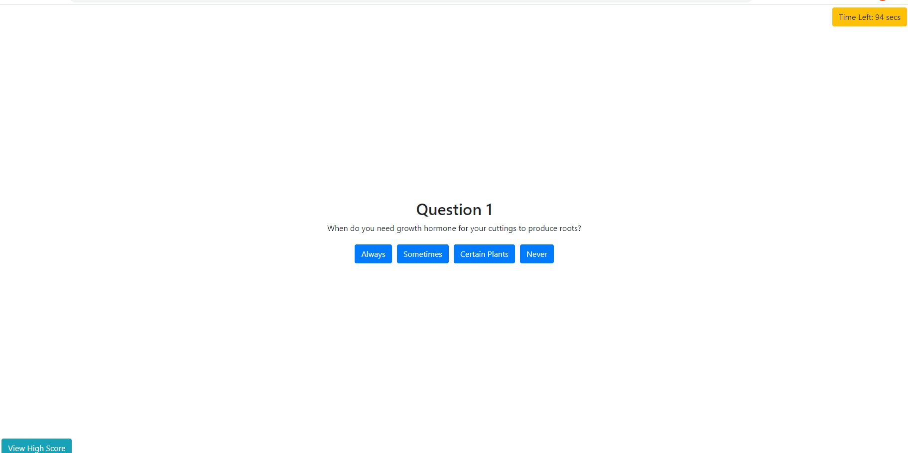

# 04 Gardener's Plant Cuttings Quiz

This is homework week 4 with a functioning Gardener's Plant Cuttings Multiple Choice Quiz.

It has a View High Scores Button leading to the High Scores page.

The timer appears and starts after START QUIZ is selected.

The timer will remove a set number if the answer is wrong, and add a set number if the answer is correct.

The final question will lead to the initials page, where the user will submit his/her initials.

The initials submission leads to the View High Scores Page where the user can go back or clear all scores.

## Notes:

This assignment proved exceedingly difficult, and lengthy. There are many other ways of solving this homework, but this is the one I used, and it may not be the most optimal method.

## Site Image

